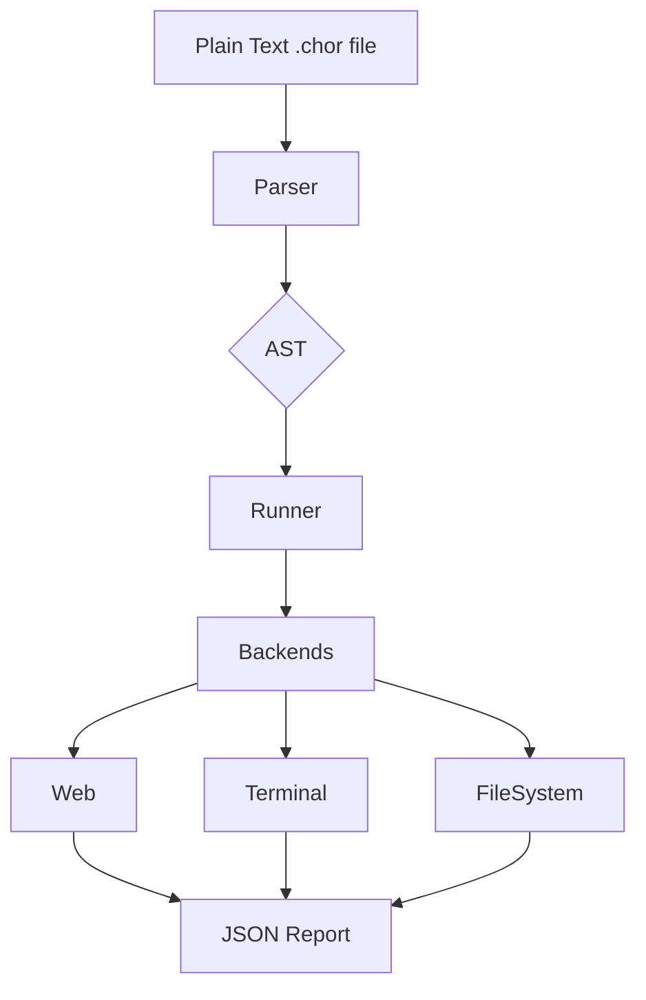

# Architecture Overview

This document provides a high-level overview of the architecture of our system, detailing the main components and their
interactions.

The architecture of `choreo is designed to be a simple, linear pipeline that transforms human-readable text into
concrete actions and verifiable results. It follows a classic **parser-runner** model, where the logic for understanding
the language is completely separate from the logic for executing the test steps. This makes the system modular and easy
to extend with new commands or even new backends.

## Data Flow Diagram

The entire process can be visualised as a clear data flow:

Plain Text (`.chor` file) -> Parser (Pest) -> Abstract Syntax Tree (AST) -> Runner -> Backends (`Web`, `Terminal`,
`FileSystem`) -> Test Result (JSON Report)

## Component Breakdown

### 1. The Parser

The parser ensures that the structure of the test is correct, checking for things like valid keywords, proper nesting of
scenarios and tests, and correct usage of actors. If the syntax is valid, it produces an AST that the runner can then
process. See our [Grammar & Parser documentation](../grammar-and-parser) for more details.

### 2. The Runner & Backends

The runner is responsible for orchestrating the entire test execution, ensuring that each step is performed in the
correct order and that the results are collected and reported accurately.
It takes the AST produced by the parser and walks through it, executing each step in sequence. The runner delegates the
actual execution of commands and assertions to the appropriate backend based on the declared actors.

### 3. The Backends

The backends are responsible for interacting with the outside world and reporting success or failure back to the
runner. Each backend implements a specific set of commands and assertions that are relevant to its domain.

#### Web Backend

See our [Web Actor documentation](../backend-web) for documentation and [usage examples](../examples-web).

#### Terminal Backend

See our [Terminal Actor documentation](../backend-terminal) for documentation
and [usage examples](../examples-terminal).

#### FileSystem Backend

See our [FileSystem Actor documentation](../backend-filesystem) for documentation
and [usage examples](../examples-filesystem).

### 4. Results & Reporting

The Reporter: Finally, mention that after the runner completes all tests, the results are compiled into a structured
JSON report, making it easy to integrate with CI/CD systems.